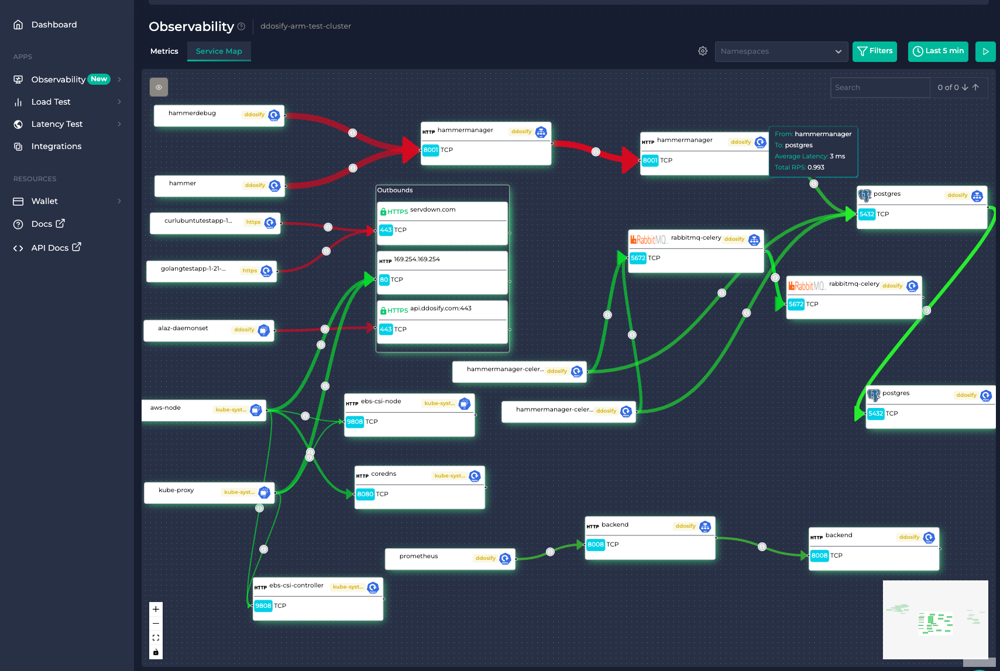

# Anteon Helm Charts

Welcome to the official [Helm chart repository](https://github.com/getanteon/anteon-helm-charts) for Anteon!
These charts can be used to deploy **Anteon Platform** and **eBPF agent (Alaz)** on a Kubernetes cluster.

Anteon Platform consists of two main components:

- **Kubernetes Monitoring**: Easy to use, comprehensive monitoring for Kubernetes clusters with no code changes.
- **Performance Testing**: No-code user simulation to test the performance of your applications.

## Available Charts

- [Anteon Platform Self-Hosted Chart](https://getanteon.com/docs/helm-charts/anteon): Deploys the Anteon Platform on your Kubernetes cluster, providing powerful insights and monitoring capabilities for your applications.

- [Anteon eBPF Agent (Alaz) Chart](https://getanteon.com/docs/helm-charts/alaz): Deploys the Anteon eBPF agent, Alaz, on your Kubernetes cluster. Alaz collects and sends data to the Anteon Platform, enabling you to monitor the performance and health of your cluster.

## About Anteon

Anteon is an observability platform designed to provide comprehensive monitoring for Kubernetes clusters. With the help of eBPF technology, Anteon automatically generates a service map of your Kubernetes cluster without the need for code instrumentation or sidecars. This allows you to easily identify and address bottlenecks in your system. Anteon also provides performance testing capabilities, allowing you to simulate user traffic and test the performance of your applications.

_The service map generated by Anteon. Red lines indicate potential bottlenecks._

For more information about each chart, please refer to the respective README files. If you have any questions or issues, feel free to open an issue on our [GitHub repository](https://github.com/getanteon/anteon-helm-charts/issues).

## Communication

You can join our [Discord Server](https://discord.com/invite/9KdnrSUZQg) for discussions, support, and community updates.
